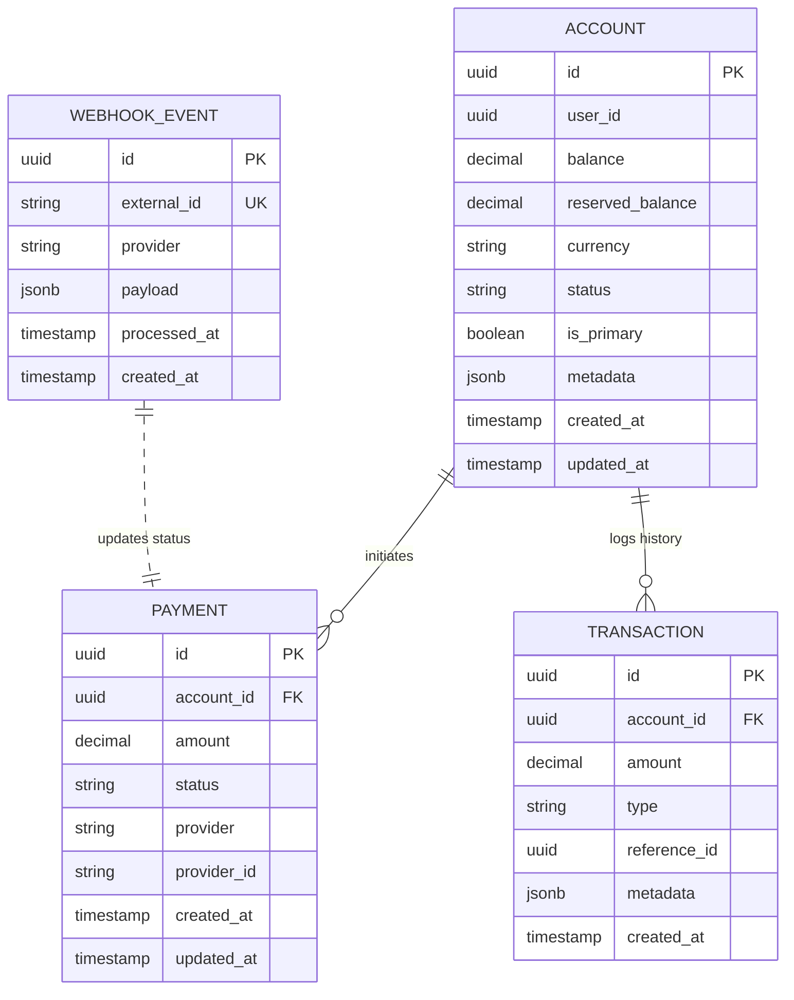

# Entities & Data Model

This document provides an overview of the core entities of the Payment Orchestration Layer. Click on each entity below to view detailed documentation.

---

## Table of Contents

1. [Account](./entities/ACCOUNT.md) - Cached balance management
2. [Transaction](./entities/TRANSACTION.md) - Immutable ledger and audit log
3. [Payment](./entities/PAYMENT.md) - Payment lifecycle through external providers
4. [WebhookEvent](./entities/WEBHOOK_EVENT.md) - Idempotent webhook processing

---

## Quick Overview

### [Account](./entities/ACCOUNT.md)
Represents the current **cached balance** of a user. Source of truth for fast O(1) balance reads.
- Holds available funds and currency
- Balance must never be negative
- Uses pessimistic locking for concurrency control

### [Transaction](./entities/TRANSACTION.md)
**Immutable audit log** (append-only) of every financial movement.
- Complete financial audit trail
- Types: `payment_received`, `refund`, `withdrawal`, `deposit`
- Sum of all transactions equals Account balance

### [Payment](./entities/PAYMENT.md)
Tracks the lifecycle of a payment intent through external providers (Stripe, PayPal).
- Manages state machine: `pending` → `processing` → `succeeded` / `failed`
- Links to external provider IDs
- Supports refunds and cancellations

### [WebhookEvent](./entities/WEBHOOK_EVENT.md)
Raw log of incoming notifications from external providers to ensure **Idempotency**.
- Prevents double-processing using `external_id`
- Stores raw webhook payloads
- Acts as fallback if Redis cache is unavailable

---

## Entity Relationship Diagram

---

## Architecture Patterns

This data model implements:
- **Hybrid Balance Pattern**: Cached balances (Account) + Immutable ledger (Transaction)
- **Idempotency**: WebhookEvent prevents duplicate processing
- **State Machine**: Payment lifecycle management
- **Audit Trail**: Complete transaction history
- **Concurrency Control**: Pessimistic locking on Account modifications

For detailed field definitions, constraints, and indexes, see the individual entity documentation linked above.
